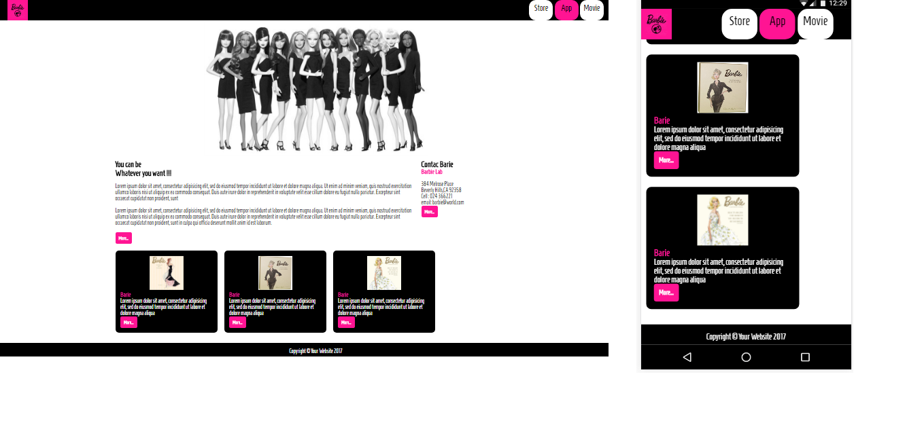

## MY PAGE - CHALLENGE
Esta en una website en la cual se visualizará dos tipos de maquedado de acuerdo a la medida de la ventana del navegador (disminuir el tamaño de la ventana para visualizarlo).

### Herramientas  
Se hizo uso de la herramienta @media query para los estilos de los diferentes tamaños de ventana del navegador.

- CSS
- HTML

### Producto Final

